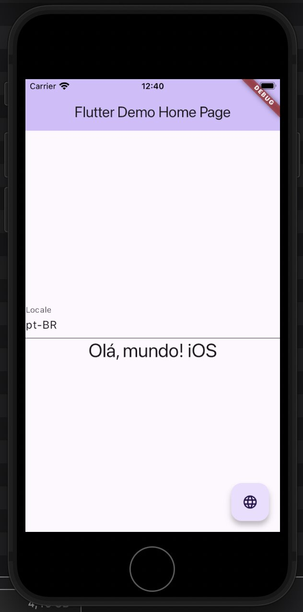
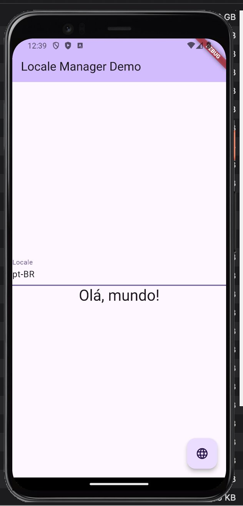

# locale_manager

The LocaleManagerPlugin is a Flutter plugin that allows you to update the native language setting of the app for both iOS and Android. This can be useful when you want to dynamically change the app’s language.


## Usage
 
To use this plugin, add `locale_manager` as a [dependency in your pubspec.yaml file](https://flutter.io/platform-plugins/).

```yaml

dependencies:
	locale_manager: any

```

### Available Methods

- `setLocale`: Sets the native language of the app. Parameter: locale (String) - the language code to set (e.g., en-US, pt-BR). 
- `getLocale`: Returns the current language of the app.
- `getLocalized`: Returns the localized string for a specific key.

## Example

Follow the demo app in [example project](./example/).

### iOS video demo
[](https://drive.google.com/file/d/1Z4gD_-o9DzbOY9QiaCRIrzHb6Bu50skN/view?usp=share_link)

### Android video demo
[](https://drive.google.com/file/d/1JPSZZEZ1GjNH6u0KSrVIfstEKdyUioXn/view?usp=share_link)

## Limitations

The iOS plugin updates the View only if the specified language is supported by the app. If the language is not supported, the app will continue to use the previous language until restart.


## Contributions

Contributions are welcome. Please open a PR. Note that this project is still in its early stages and may have some bugs. If you find any, please open an issue.

We need help with the following:
- [ ] Adding tests
- [ ] Web support
- [ ] MacOS support
- [ ] Windows support
- [ ] Linux support


## License

This project is licensed under the MIT License - see the [LICENSE](./LICENSE) file for details.

